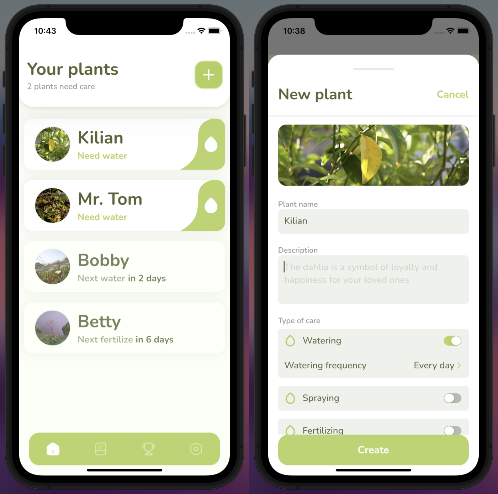

# Plant Care Reminder Application

This project is a **Plant Care Reminder App** built using the **Flutter** framework. It helps users take care of their plants by providing reminders for various plant care activities such as watering, spraying, and fertilizing. The app is designed with a user-friendly interface and offers several features to make plant care easier and more engaging.

The app follows an **MVC (Model-View-Controller)** architecture and was developed as part of a university project at **Brno University of Technology**.

[Video](xkoval21_video.mp4)

## Features

- **Customizable Care Reminders**: Set reminders for different plant care activities like watering, fertilizing, and more.
- **Plant Photo Upload**: Users can upload images of their plants for easy identification.
- **Care History and Calendar**: View and edit past care activities using a calendar interface.
- **Achievement System**: Gamified experience with achievements to motivate users to care for their plants regularly.
- **Care Tips**: Provides helpful tips on plant care directly within the app.
- **Dark/Light Theme Support**: Switch between themes for a personalized experience.

